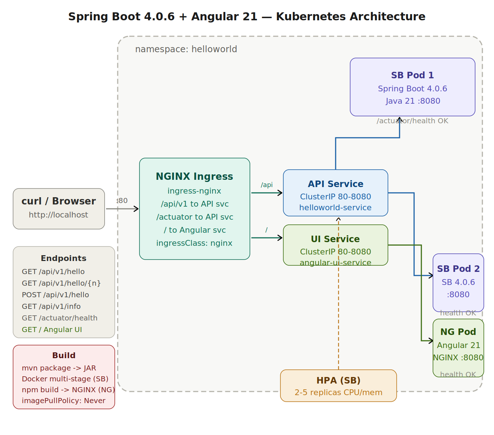

# Spring Boot 4.0.6 + Angular 21 → Local Kubernetes

A full-stack Hello World app — **Spring Boot 4.0.6** REST API + **Angular 21** frontend — containerized with Docker and deployed to a local Kubernetes cluster. A single NGINX Ingress routes everything through `http://localhost`.

---

## 🏗️ Architecture



> All traffic enters via NGINX Ingress on port 80. `/api/v1/*` and `/actuator/*` route to the Spring Boot ClusterIP service (load balanced across 2 pods). `/` routes to the Angular UI service (NGINX pod serving the built SPA). The HPA autoscales Spring Boot pods between 2 and 5 based on CPU/memory.

---

## 📁 Project Structure

```
springboot-k8s/
├── src/                                    ← Spring Boot 4.0.6
│   └── main/java/com/example/helloworld/
│       ├── HelloWorldApplication.java
│       ├── controller/HelloWorldController.java
│       └── config/CorsConfig.java
├── angular-ui/                             ← Angular 21
│   ├── src/
│   │   ├── app/
│   │   │   ├── app.component.ts            ← Root (standalone)
│   │   │   ├── app.config.ts               ← HttpClient, providers
│   │   │   ├── hello/
│   │   │   │   ├── hello.component.ts      ← Main page (4 tabs)
│   │   │   │   ├── hello-world.service.ts  ← API service
│   │   │   │   └── response-card.component.ts
│   │   │   └── shared/models/api.models.ts
│   │   ├── environments/
│   │   │   ├── environment.ts              ← dev (proxy to :8080)
│   │   │   └── environment.prod.ts         ← prod (K8s ingress)
│   │   ├── index.html
│   │   └── styles.scss
│   ├── Dockerfile                          ← node:22 build → nginx serve
│   ├── nginx.conf                          ← SPA routing + gzip
│   ├── proxy.conf.json                     ← Dev proxy /api → :8080
│   ├── angular.json
│   ├── package.json                        ← Angular 21 deps
│   └── tsconfig.json
├── k8s/
│   ├── 00-namespace.yaml
│   ├── 01-deployment.yaml                  ← Spring Boot (2 replicas)
│   ├── 02-service.yaml                     ← helloworld-service
│   ├── 03-ingress.yaml                     ← Routes / and /api/v1/*
│   ├── 04-hpa.yaml
│   ├── 05-angular-deployment.yaml          ← Angular UI (1 replica)
│   └── 06-angular-service.yaml             ← angular-ui-service
├── scripts/
│   ├── deploy.sh                           ← Builds & deploys both
│   ├── install-ingress.sh
│   └── cleanup.sh
├── Dockerfile                              ← Spring Boot multi-stage
├── pom.xml
└── README.md
```

---

## ✅ Prerequisites

| Tool | Version | Notes |
|------|---------|-------|
| Java | 21+ | For Spring Boot |
| Maven | 3.9+ | Build tool |
| Node.js | 22+ | For Angular |
| npm | 10+ | Package manager |
| Docker | 24+ | Container runtime |
| kubectl | 1.28+ | K8s CLI |
| Local K8s | Any | Docker Desktop / Minikube / kind |

---

## 🚀 Quick Start (3 steps)

### Step 1 — Start your local Kubernetes cluster

**Option A: Docker Desktop** (easiest)
```bash
# Settings → Kubernetes → Enable Kubernetes → Apply & Restart
```

**Option B: Minikube**
```bash
minikube start --driver=docker --memory=4096 --cpus=2
```

**Option C: kind** (with port mappings for ingress)
```bash
cat <<EOF | kind create cluster --config=-
kind: Cluster
apiVersion: kind.x-k8s.io/v1alpha4
nodes:
  - role: control-plane
    kubeadmConfigPatches:
      - |
        kind: InitConfiguration
        nodeRegistration:
          kubeletExtraArgs:
            node-labels: "ingress-ready=true"
    extraPortMappings:
      - containerPort: 80
        hostPort: 80
        protocol: TCP
EOF
```

### Step 2 — Install NGINX Ingress Controller

```bash
chmod +x scripts/*.sh
./scripts/install-ingress.sh
```

> **Minikube only** — run this in a **separate terminal** and keep it open:
> ```bash
> minikube tunnel
> ```

### Step 3 — Build & Deploy everything

```bash
./scripts/deploy.sh
```

This builds the Maven JAR, the Spring Boot Docker image, the Angular production bundle, the Angular Docker image, loads both into your cluster, and applies all 7 Kubernetes manifests.

---

## 🌐 Access the Application

| URL | What you get |
|-----|-------------|
| `http://localhost/` | **Angular UI** — interactive API explorer |
| `http://localhost/api/v1/hello` | Spring Boot GET endpoint |
| `http://localhost/api/v1/hello/{name}` | Personalised greeting |
| `http://localhost/api/v1/info` | Service metadata |
| `http://localhost/actuator/health` | K8s health check |

---

## 🖥️ Angular UI Features

The Angular 21 app is a fully standalone, signals-based frontend:

- **4 tabs** — one per API endpoint (GET /hello, GET /hello/{name}, POST /hello, GET /info)
- **Response card** with highlighted message, key/value breakdown, timestamp, and raw JSON toggle
- **Live status pill** — turns green when the API is reachable
- **URL preview** — shows the exact request being made as you type
- **Angular Signals** for reactive state (no RxJS subjects in components)
- **HttpClient with `withFetch()`** — Angular 21 modern fetch adapter
- **Standalone components** throughout — no NgModule

---

## 💻 Local Development (hot-reload)

Run Angular with the CLI dev server (proxies `/api` to Spring Boot):

```bash
# Terminal 1 — start Spring Boot
mvn spring-boot:run

# Terminal 2 — start Angular dev server
cd angular-ui
npm install
npm start         # http://localhost:4200
```

The `proxy.conf.json` forwards all `/api/*` requests to `http://localhost:8080`, so no CORS issues during development.

---

## 🔧 Manual Commands

### Build Spring Boot only
```bash
mvn clean package -DskipTests
docker build -t helloworld:1.0.0 .
```

### Build Angular only
```bash
cd angular-ui
npm install
npm run build:prod
docker build -t angular-ui:1.0.0 .
```

### Apply manifests manually
```bash
kubectl apply -f k8s/
```

### Check everything
```bash
kubectl get all -n helloworld
kubectl describe ingress helloworld-ingress -n helloworld
```

### Logs
```bash
kubectl logs -f deployment/helloworld-deployment -n helloworld
kubectl logs -f deployment/angular-ui-deployment  -n helloworld
```

### Scale Spring Boot manually
```bash
kubectl scale deployment helloworld-deployment --replicas=3 -n helloworld
```

### Port-forward (bypass ingress for debugging)
```bash
# Spring Boot direct
kubectl port-forward service/helloworld-service 8080:80 -n helloworld

# Angular direct
kubectl port-forward service/angular-ui-service 4200:80 -n helloworld
```

---

## 🗑️ Cleanup

```bash
./scripts/cleanup.sh
```

---

## 🔍 Troubleshooting

| Problem | Fix |
|---------|-----|
| `ImagePullBackOff` | Image not in cluster — run `deploy.sh` which auto-loads it |
| Angular 404 on deep routes | NGINX `try_files` handles SPA routing — check `nginx.conf` |
| API calls fail from Angular | Verify ingress routes `/api/v1` before `/` |
| Minikube: nothing at localhost | Run `minikube tunnel` in a separate terminal |
| `npm ci` fails | Use Node 22+ — Angular 21 requires it |

---

## 📡 API Reference

| Method | Path | Description |
|--------|------|-------------|
| `GET` | `/api/v1/hello` | Hello World |
| `GET` | `/api/v1/hello/{name}` | Personalised greeting |
| `POST` | `/api/v1/hello` | Greeting from JSON body |
| `GET` | `/api/v1/info` | Service info |
| `GET` | `/actuator/health` | Health check |
| `GET` | `/actuator/metrics` | Metrics |
| `GET` | `/` | Angular UI |
